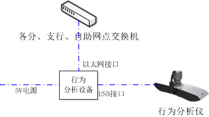

#设备简介
嵌入式防护舱内行为分析设备采用3D环境探测技术，能够对监控场景的3D信息进行探测和建模，进而对场景内的人和物进行准确的检测和跟踪，动态计算场景内人和物的物理尺寸、位置、速度、相对位置等信息。以这些信息为基础，嵌入式3D行为分析设备针对金融安防领域的三大场景（ATM厅、ATM防护舱以及加钞间）设计了专门的智能预警策略，检测不同场景中出现的异常情况并报警，提示监控中心关注可能发生的异常行为，预防违法犯罪事件的发生。

嵌入式防护舱内行为分析设备能够对监控场景内出现的如下情况进行分析和报警：
人物进入和离开、滞留、倒地、下蹲、一米区违规、尾随、物品滞留等等。
#安装部署

戍融智能嵌入式防护舱内行为分析设备的完整包装包含如下：

1. 行为分析仪一个
2. 行为分析设备一个
3. 电源一个
4. 支架一个

安装前需要使用电脑配置行为分析设备的网络参数，主要指IP地址和子网掩码。这需要使用一个简单的配置工具SRZNConfig。具体使用步骤如下：

1. 将行为分析设备用网线与电脑直连或与电脑连接到同一台交换机并连接电源，确认行为分析设备上网卡指示灯持续闪亮；
2. 将电脑的IP地址设为192.168.\*.\*地址段，并将子网掩码设为255.255.0.0。
3. 运行配置工具SRZNConfig，该工具会自动搜索与电脑相连的行为分析设备并列表显示，搜索过程会持续5\~15秒左右，请耐心等待；
4. 使用SRZNConfig连接搜索到的行为分析设备，设置所需的网络参数。

网络参数设置完成后，就可以进行实地安装了。安装时请使用行为分析仪支架固定行为分析仪，然后按照下图所示安装接线。将行为分析仪与行为分析设备上的任意USB接口相连，最后将行为分析设备固定在行为分析仪附近的墙面或天花板上，并接通电源和网线。完成后就可以使用远程管理软件对安装好的行为分析设备进行远程配置并接收报警信息了。

#原理与逻辑

行为分析设备必须与配套的3D行为分析仪配套使用。行为分析仪能够探测观测范围内的物体与自身的距离，从而形成环境的立体图像。行为分析设备能够对立体图像进行分析，从而提取场景中的人和物的大小，高度以及位置信息。通过对这些信息进行分析，可以判定场景中人和物所处的状态，如运动与静止，站立与倒下；也可以计算人物的运动速度，移动距离等信息。依据这些信息，就可以按照预定的规则进行报警。例如，如果场景中的某个人的高度突然降低到接近地面的程度，那么就报“有人倒地”。

行为分析设备的正常工作依赖行为分析仪的正常成像。正常工作时，行为分析仪不断向周围发射红外激光，并探测周围物体反射的激光信号。如果场景中有阳光直射的情况，阳光中强烈的红外光会掩盖周围物体的反射光，从而导致行为分析仪无法成像。因此，行为分析设备不适用于白天露天环境。

#报警功能说明

防护舱内行为分析设备的报警功能主要针对防护舱内的场景设计，主要包括两类功能，一是针对防护舱内场景的智能分析功能，如遗留物检测、尾随检测、倒地/下蹲检测等等；一类是针对设备自身的诊断功能，如行为分析仪异常检测等等。

行为分析仪的所有功能的工作范围限制在“布防区域”内，只有在布防区域内发生的异常情况才会触发报警。因此在行为分析设备部署完成后，必须划定“布防区域”。

##防护舱内相关功能
* **物品滞留检测功能**
	* **报警项目：**物品滞留
	* **功能说明：**客户进入防护舱，在防护舱内客户将有一定体积的遗留物（厚度高于15cm，长宽均大于10cm）放在地面，并离开防护舱超过一定时间，系统会立即触发“物体滞留”报警。
	* **可调参数：**
		* *物品滞留阈值：*单位为秒，其含义为：人员进入后将遗留物放下，再远离遗留物，超过多少秒会触发报警。
		* *无体积物体检测开关：*如果打开则系统会检测无体积物体，如地面的报纸、地毯等等，这会增加物品物品滞留的误报率
	* **相关区域设置：**布防区域
* **尾随检测功能**
	* **报警项目**：疑似尾随
	* **功能说明**：客户1进入防护舱，在客户1进入3s后10s前第二人进入防护舱，系统会立即触发“有人尾随”报警。
	* **可调参数**：
		* *尾随时间阈值：*单位为秒，其含义为：一人在一米区内办理业务时，另一人在其附近停留时间超过该值，则触发报警。
	* **相关区域设置**：布防区域，一米区
* **人员滞留检测**
	* **报警项目**：人员滞留
	* **功能说明**：客户1人进入防护舱，在防护舱内长时间停留，系统会立即触发“有人滞留”报警。
	* **可调参数**：
		* *人物滞留阈值：*单位为秒，其含义为：布防区域内人员滞留时间超过该值则触发报警。
	* **相关区域设置**：布防区域
* **人员倒地检测功能**
	* **报警项目**：有人倒地
	* **功能说明**：客户1人进入防护舱，在防护舱内客户突然倒地，系统会立即触发“有人倒地”报警。
	* **可调参数**：
		* *倒地时间阈值：*单位为秒，其含义为：布防区域内人员倒地后维持倒地的状态的时间超过该值则触发报警。
	* **相关区域设置**：布防区域
* **人员下蹲检测功能**
	* **报警项目**：有人下蹲 
	* **功能说明**：客户1人进入防护舱，在防护舱内客户下蹲，并维持下蹲姿态超过一定时间，系统会立即触发“有人下蹲”报警。
	* **可调参数**：
		* *下蹲时间阈值：*单位为秒，其含义为：布防区域内人员下蹲后维持下蹲的状态的时间超过该值则触发报警。
	* **相关区域设置**：布防区域
* **尾随抢劫检测功能**
	* **报警项目**：尾随抢劫
	* **功能说明**：客户1人进入防护舱，在客户1进入3s后10s前第二人进入防护舱（即出发“有人尾随”报警后），检测到剧烈运动，则出发“尾随抢劫”报警。
	* **可调参数**：
		* *下蹲时间阈值：*单位为秒，其含义为：布防区域内人员下蹲后维持下蹲的状态的时间超过该值则触发报警。
	* **相关区域设置**：布防区域、一米区
* **强行推入检测功能**
	* **报警项目**：强行推入
	* **功能说明**：客户1人进入防护舱，办理完业务后准备出去（越过了出一米区的拌线），这时突然被客户2推入，再次反向越过一米区拌线，之后客户2也进入防护舱。
	* **可调参数**：
		* *下蹲时间阈值：*单位为秒，其含义为：布防区域内人员下蹲后维持下蹲的状态的时间超过该值则触发报警。
	* **相关区域设置**：布防区域、一米区、拌线区
* **推入抢劫检测功能**
	* **报警项目**：推入抢劫
	* **功能说明**：在“强行推入”报警触发后，又检测到剧烈运动，则触发“推入抢劫”报警。
	* **可调参数**：
		* *下蹲时间阈值：*单位为秒，其含义为：布防区域内人员下蹲后维持下蹲的状态的时间超过该值则触发报警。
	* **相关区域设置**：布防区域、一米区、拌线区

##设备自检相关功能
* **行为分析仪异常检测功能**
	* **报警项目**：行为分析仪异常
	* **功能说明**：客户进入监控区域，用异物遮挡行为分析仪镜头，系统会立即触发“行为分析仪异常”报警。
	* **可调参数**：无
	* **相关区域设置**：无
* **场景变换检测功能**
	* **报警项目**：疑似场景变换
	* **功能说明**：监控场景内发生突然的光线变化，或者有人在不遮挡摄像头的情况下大幅度移动摄像头后，系统会立即触发“疑似场景变换”报警。
	* **可调参数**：无
	* **相关区域设置**：无

#参数设置说明

在行为分析设备安装完成后，需要对其进行设置，才能使其正常工作。行为分析设备的参数包含两类：第一类是与功能相关的各种阈值，另一类是需要划定的各种区域。第一类参数都具有默认值，一般情况下默认值能确保行为分析设备的基本功能正常；第二类参数则需要根据部署的环境进行划定。

行为分析设备安装完成后首先要划定的是“布防区域”。行为分析设备的所有功能的工作范围限制在“布防区域”内，只有在布防区域内发生的异常情况才会触发报警。因此，“布防区域”必须划定，才能确保行为分析设备的各项功能正常。此外，有些功能需要设置相应的区域才有效，这些与区域相关的功能主要包括：一米区违规检测、强行进入检测、越过拌线检测、箱门打开检测、单人加钞检测、重要物品丢失检测。下面将依据可设置的不同区域类型分别进行介绍。

* **布防区域：**整个系统正常工作需要设置一个“布防效区”，场景中出现的人、物必须在布防区域内才会触发报警，否则不会触发报警。当有人进入布防区域时会触发“人物进入”的报警，这主要是为了播放欢迎声音设置的，一般情况下可屏蔽这类报警。

* **一米区：**系统会统计一米区内的人数，并根据设置的人数上限和下限进行报警。下限设0，上限设1就是通常意义的一米区的含义。需要注意的是：如果两人接连进入一米区，则系统会报“一米区违规”，如果一人先进入，过段时间后，另一人进入，则系统会报“区域强行进入”。

* **拌线：**拌线绘制时会显示一条折线和一个箭头，折线就是拌线的位置，箭头指出拌线的方向，沿该方向穿过拌线会报警“越过拌线”。

* **箱门区：**设计目标是检测钞箱门的打开，划定时应当覆盖某个门所在区域，并保证门打开后，可以看到门内的空间。在设置时需保证前端初始化时箱门是关闭的。一旦检测到箱门打开，会除法报警“箱门打开”

* **加钞区：**用于检测“单人加钞”，加钞区应划定在钞箱打开时人一般站定的位置，设定后，如果加钞区有1人，且整个有效区内也只有一人，会报“单人加钞”。

* **入侵检测区：**有人进入时就会报“强行进入”的报警。

* **重要物品保护区：**设计用于保护重要物品，划定时应当恰好将要保护的物体框在内，物体被拿走后会报警物品丢失。设置时需保证前端初始化时物品是存在的，如果划定区域时物品不存在，那么在划定区域后，需放入物品，然后重新初始化通道。此外，被保护的物品必须是体积较大、有一定高度的物体，即类似“遗留物”的物体，不能是类似“粘贴物”的物体。一旦检测到重要物品在场景中消失，会触发“物品遗失”的报警。
