{width="2.8854166666666665in"
height="0.9895833333333334in"}

主动智能视觉分析预警管理程序

安装说明书

**目 录**

[*1、数据库安装* - 2 -](#数据库安装)

[*1.1准备工作* - 2 -](#准备工作)

[*1.2安装* - 2 -](#安装)

[*1.2选择 "全新sqlserver 独立安装或向现有安装添加功能"* - 2
-](#选择-全新sqlserver-独立安装或向现有安装添加功能)

[*1.3安装程序支持规则* - 3 -](#安装程序支持规则)

[*1.4安装程序支持文件* - 4 -](#安装程序支持文件)

[*1.5安装程序支持规格* - 4 -](#安装程序支持规格)

[*1.6输入产品密钥* - 5 -](#输入产品密钥)

[*1.7许可条款* - 6 -](#许可条款)

[*1.8数据库系统功能选择* - 7 -](#数据库系统功能选择)

[*1.9实例配置* - 7 -](#实例配置)

[*1.10磁盘空间要求* - 8 -](#磁盘空间要求)

[*1.11服务器配置* - 9 -](#服务器配置)

[*1.12数据库引擎配置* - 9 -](#数据库引擎配置)

[*1.13错误和使用情况报告* - 11 -](#错误和使用情况报告)

[*1.14安装规则* - 11 -](#安装规则)

[*1.15准备安装* - 12 -](#准备安装)

[*2、管理程序安装* - 13 -](#管理程序安装)

[*2.1、管理程序安装* - 13 -](#管理程序安装-1)

[*3数据库初始化* - 17 -](#数据库初始化)

[*3.1创建数据库* - 17 -](#创建数据库)

[*3.3配置超级管理员* - 19 -](#配置超级管理员)

[*3.4信息确认* - 20 -](#信息确认)

[*4、管理程序的使用* - 20 -](#管理程序的使用)

1、数据库安装
=============

1.1准备工作
-----------

1.1.1
数据库系统的安装最好是选择一台纯净的操作系统电脑，以防其他软件对其有冲突。

1.1.2
如果是从光驱安装，则将光盘放入光驱内。如果是从ISO文件进行安装，请先安装虚

> 拟光驱，推荐使用daemon4304-lite.exe(适用于32位的操作系统)
> 和DTLite4355-00
>
> 68(x64).exe（适用于64位的操作系统）。虚拟光驱的安装过程，系统会出现重新启动的现象。待虚拟光驱安装完毕后，使用虚拟光驱加载Sqlserver的ISO文件。也可将ISO文件解压缩后，双击"setup.exe"执行安装。

1.2安装
-------

### 1.2选择 "全新sqlserver 独立安装或向现有安装添加功能"

使用光驱或者虚拟光驱加载光盘或者ISO文件后，将出现以下界面：请选择“全新sqlserver独立安装或向现有安装添加功能”。

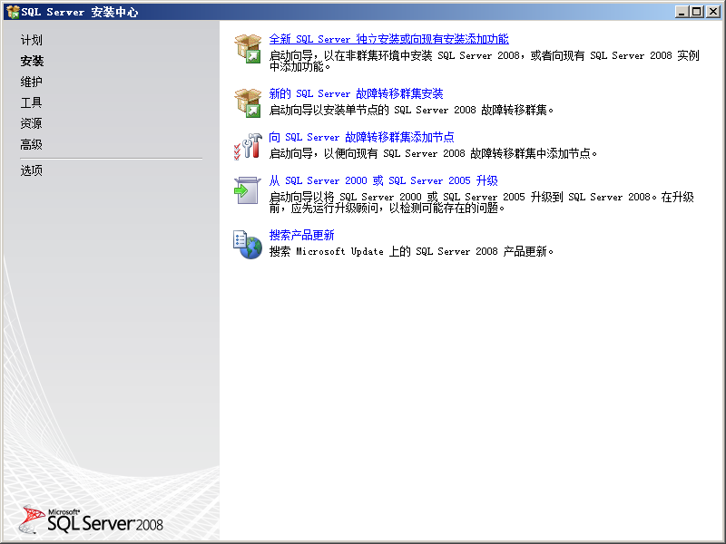{width="6.020833333333333in" height="4.5in"}

### 1.3安装程序支持规则

在1.2中选择了“全新sqlserver独立安装或向现有安装添加功能”后，安装将进入以下画面,此界面是检测系统安装环境是否符合要求。检测通过后，请点击“确定”。

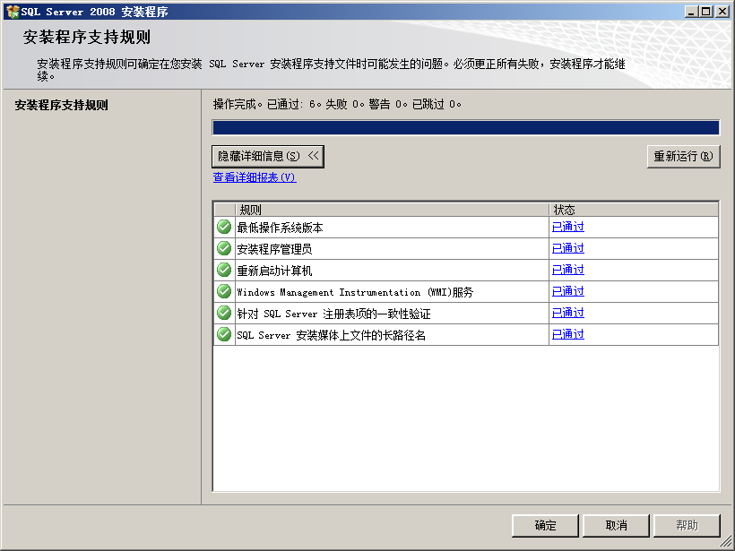{width="4.958333333333333in"
height="3.71875in"}

### 1.4安装程序支持文件

此处是检测数据库系统安装所必备的组件，点击“安装”即可。

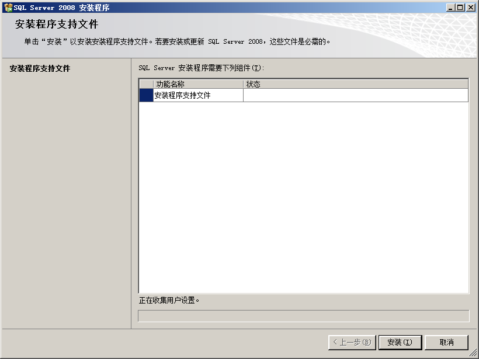{width="5.270833333333333in"
height="3.9583333333333335in"}

### 1.5安装程序支持规格

此处是检测系统中现有的软件，通过后点击“下一步”。防火墙不通过，并不影响系统的安装。

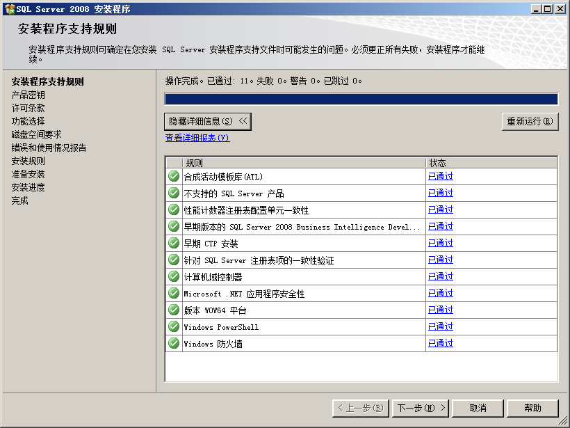{width="5.71875in"
height="4.291666666666667in"}

### 1.6输入产品密钥

产品密钥：JD8Y6-HQG69-P9H84-XDTPG-34MBB，如果此密钥失效，请去百度搜索"sqlserver2008企业版
密钥"。输入完密钥后点击“下一步”。

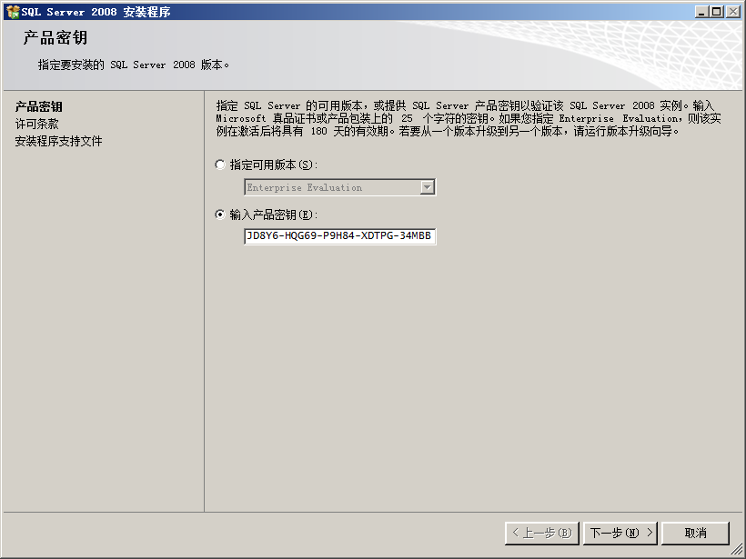{width="5.40625in"
height="4.052083333333333in"}

### 1.7许可条款

请选择“我接收许可条款”，并点击“下一步”。

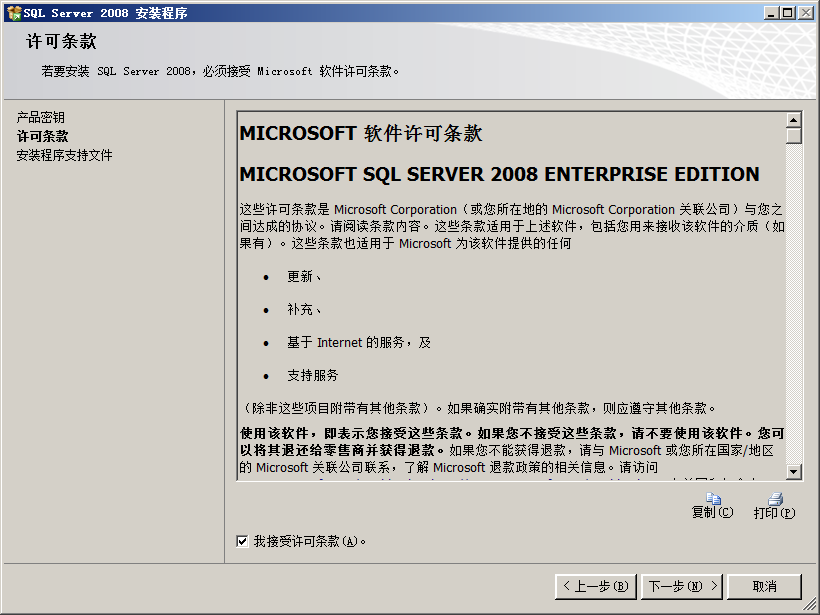{width="5.40625in"
height="4.052083333333333in"}

### 1.8数据库系统功能选择

请按下图选择数据库系统所需要的功能，全部选择并不会影响系统使用。选择完后点击“下一步”。

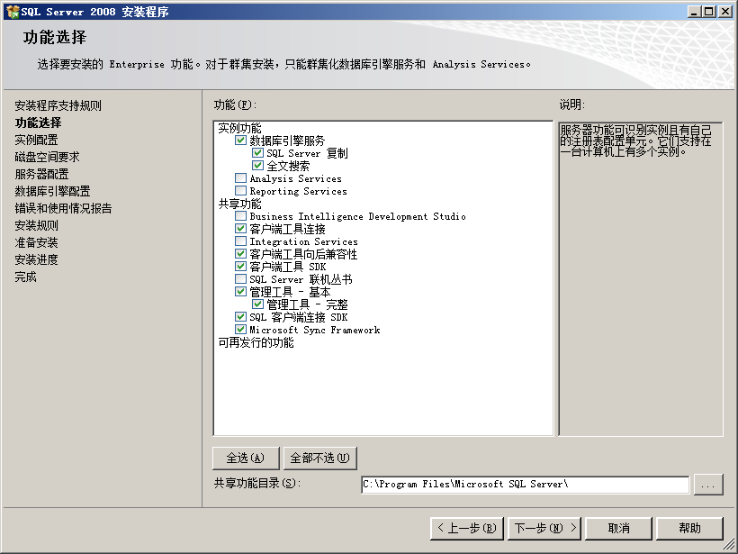{width="5.427083333333333in"
height="4.072916666666667in"}

### 1.9实例配置

请选择默认实例(采用默认名称即可)，点击“下一步”

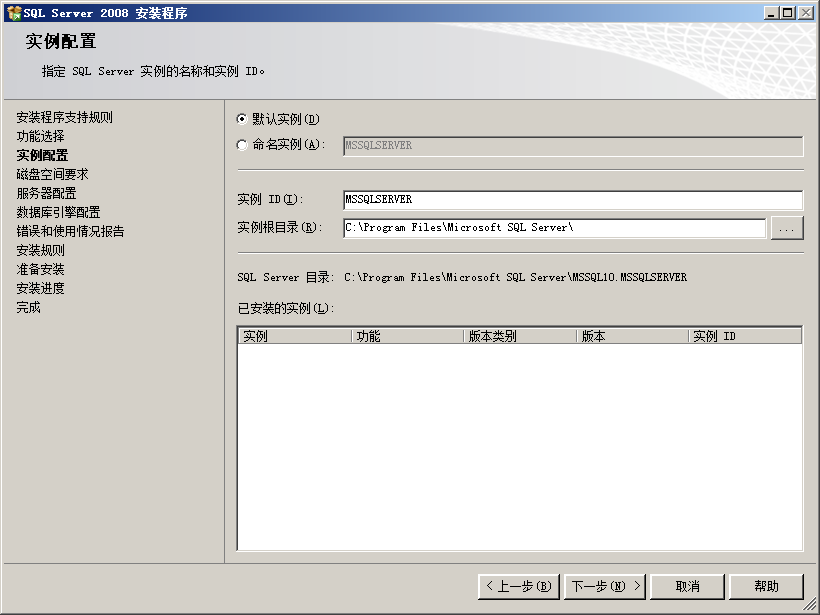{width="5.614583333333333in"
height="4.208333333333333in"}

### 1.10磁盘空间要求

检查磁盘空间，如果磁盘空间不够，请返回“上一步”修改安装路径，然后点击“下一步”。

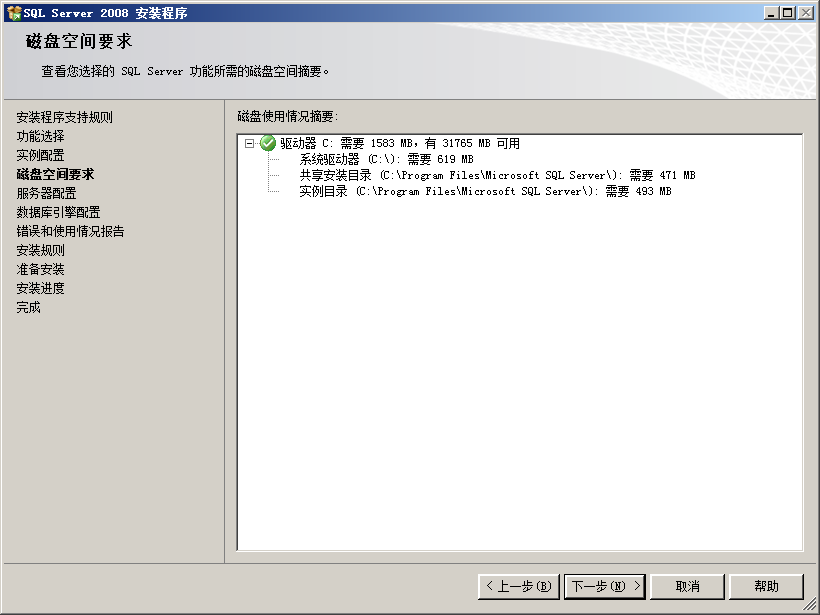{width="5.385416666666667in"
height="4.041666666666667in"}

### 1.11服务器配置

在“服务账户”选项卡中，账户名请选择“**NT AUTHORITY\\NETWORK SERVICE**”

点击“下一步”。

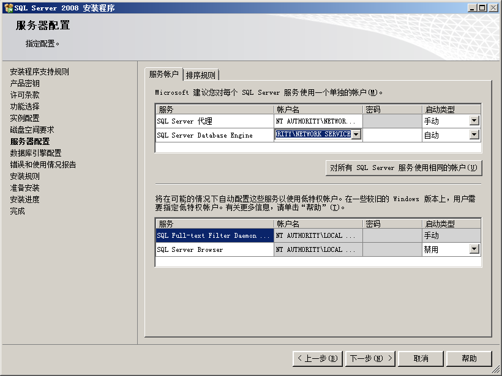{width="5.385416666666667in"
height="4.041666666666667in"}

### 1.12数据库引擎配置

[]{#_Toc364234420 .anchor}
账户设置选项卡：在身份验证模式处，选择"**混合模式**"，然后输入密码（密码必须是数字，字母和特殊符号的组合），再点击“**添加当前用户**”按钮。

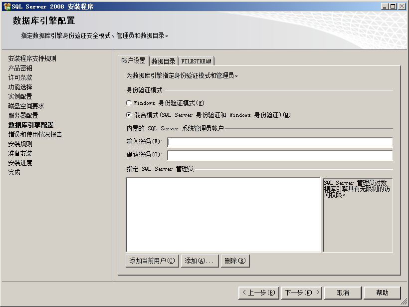{width="5.302083333333333in"
height="3.9791666666666665in"}

数据目录选项卡：请把各目录修改为非系统盘。（放置系统崩溃后数据丢失）设置完成后点击“下一步”。

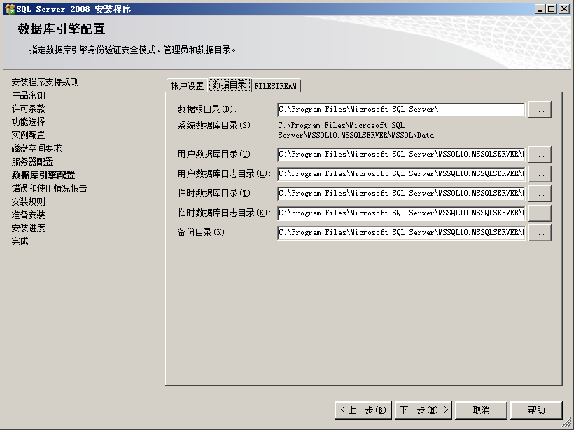{width="5.34375in"
height="4.010416666666667in"}

### 1.13错误和使用情况报告

请把两个复选框设置为取消选中状态，并点击“下一步”

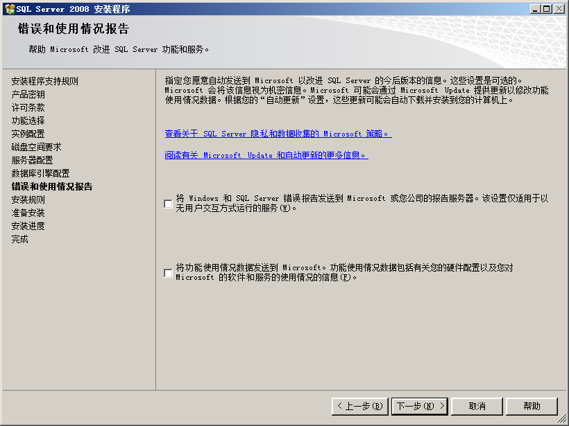{width="5.302083333333333in"
height="3.9791666666666665in"}

### 1.14安装规则

安装程序会对前面设置的步骤进行效验，如果效验失败则不能进行下一步，请返回前述步骤进行修改。只要“下一步”按钮呈可用状态，则可进行下一步安装。验证通过后点击“下一步”。

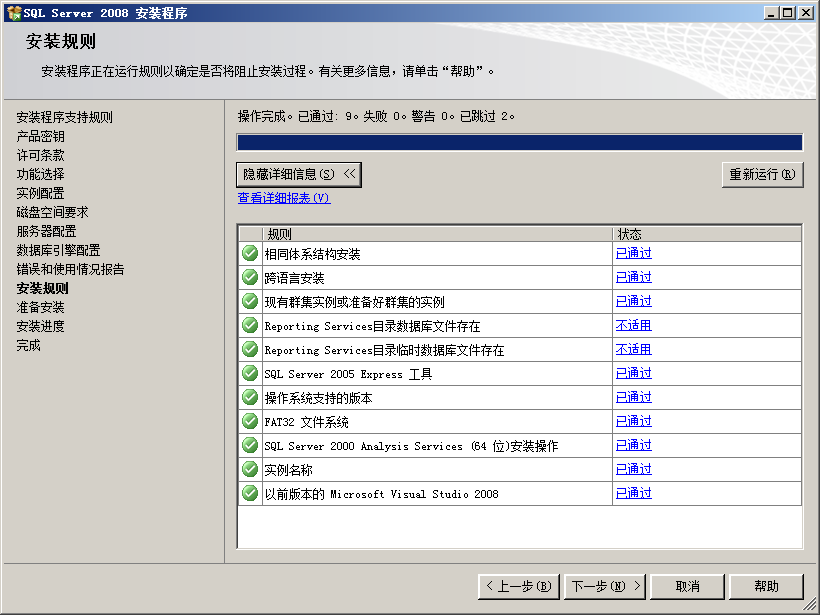{width="5.28125in"
height="3.9583333333333335in"}

### 1.15准备安装

前述步骤的所有设置，都会在此界面全部呈现。安装人员可在此处进行一一核对。确认无误后，点击“下一步”。直至最后安装完毕即可。

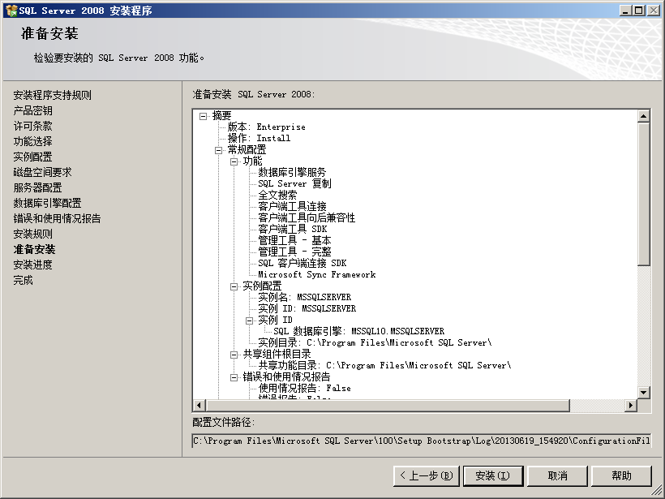{width="5.583333333333333in"
height="4.1875in"}

2、管理程序安装
===============

 2.1、管理程序安装
------------------

双击运行“ClientNewSetup\_x86\_”，进行管理程序的安装，弹出以下安装界面

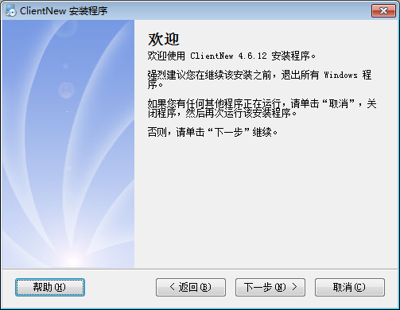{width="4.59375in" height="3.5625in"}

单击下一步，

{width="5.239583333333333in"
height="4.0625in"}

单击下一步

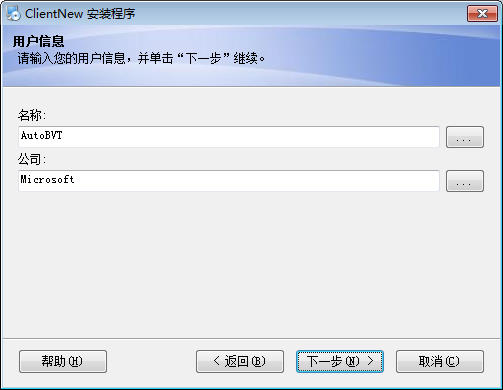{width="5.239583333333333in"
height="4.0625in"}

单击下一步

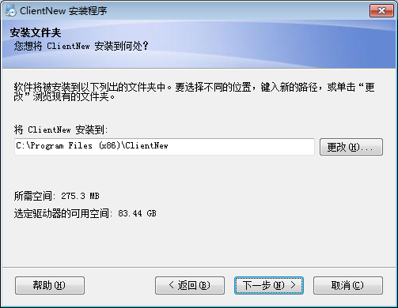{width="5.239583333333333in"
height="4.0625in"}

如需更改点击更改，选择相应的管理程序安装路径

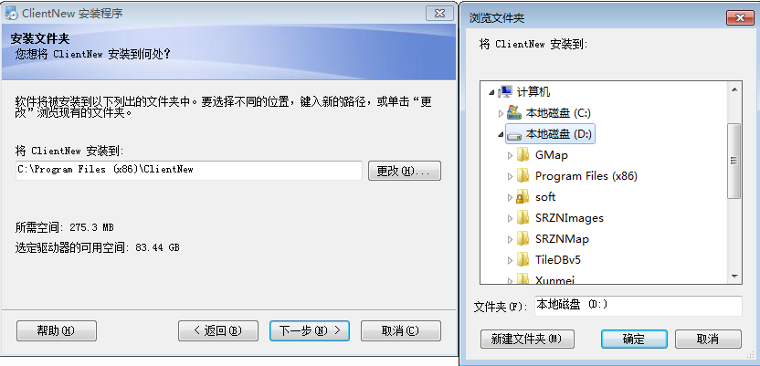{width="6.770833333333333in"
height="3.2604166666666665in"}

如果不需要修改，则一直点击下一步直到管理程序安装完成。

管理程序安装完成以后，自动进行数据库初始化/升级操作

3数据库初始化
=============

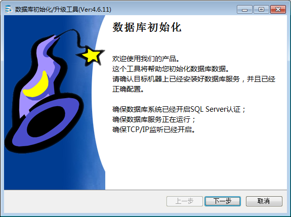{width="5.989583333333333in"
height="4.46875in"}

3.1创建数据库
-------------

数据库管理系统：MS SQL Server （默认值即可）

数据库服务器：(local) （默认值即可）

身份验证： windows 身份验证 （默认值即可）

数据库名称：BrainNew （默认值即可）

用户名： （默认值即可）

密码： （默认值即可）

数据库文件存放路径：**请选择非系统盘**

设置完毕后点击“下一步”。

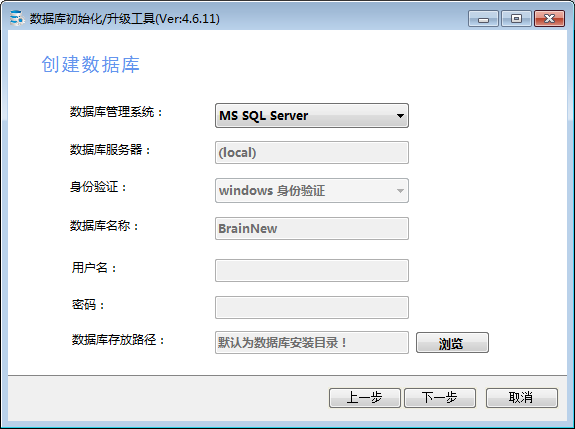{width="5.989583333333333in"
height="4.46875in"}

**3.2 数据库安装进度**

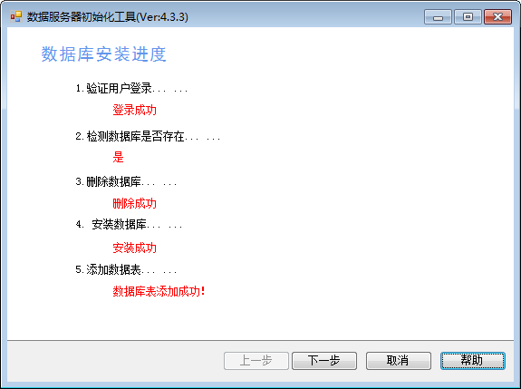{width="5.989583333333333in"
height="4.46875in"}

如果之前安装过运行过管理软件，即在数据库存在数据的情况下，则会弹出以下窗口

{width="4.229166666666667in"
height="2.3020833333333335in"}

注意：如果选“是”，即删除已经存在于数据库中所有的报警事件的数据且不可恢复(谨慎使用)，建议选“否”，即在原有的数据库上进行升级修改，点“取消”，即退出此程序的安装。

3.3配置超级管理员
-----------------

此处的超级管理员是指
主动智能视觉预警分析系统的超级管理员，一经设定则不能更改，请牢记用户名和密码。

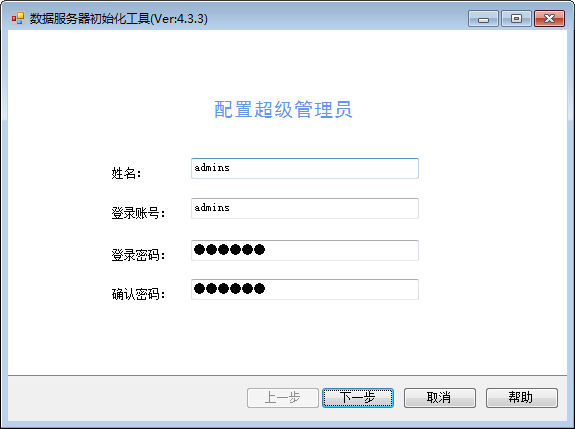{width="5.989583333333333in"
height="4.46875in"}

3.4信息确认
-----------

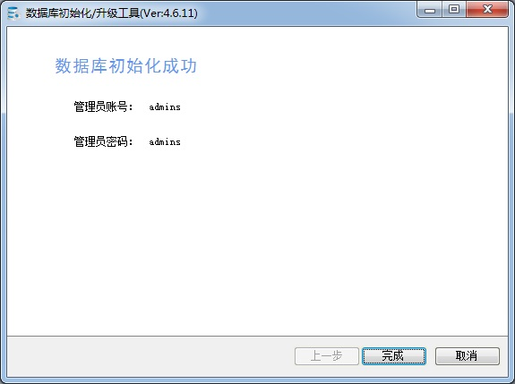{width="5.989583333333333in"
height="4.46875in"}

点完成即可完成整个数据库初始化的安装。

4、管理程序的使用
=================

[[[]{#_Toc16673 .anchor}]{#_Toc5555 .anchor}]{#_Toc17440
.anchor}点击桌面
{width="0.7395833333333334in"
height="0.9791666666666666in"}此图标，即可打开客户端界面，如下图所示，此处登录的用户名和密码，是使用数据库初始化工具时设定的超级管理员用户名和密码。

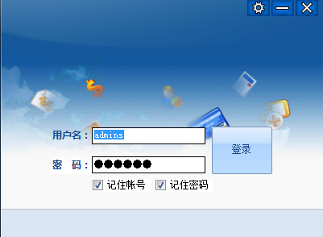{width="4.177083333333333in"
height="3.0625in"}

管理程序的使用，请参考《管理程序使用说明书》
