#1、数据库安装

##1.1准备工作

数据库系统的安装最好是选择一台纯净的操作系统电脑，以防其他软件对其有冲突。如果是从光驱安装，则将光盘放入光驱内。如果是从ISO文件进行安装，请先安装虚拟光驱，推荐使用daemon4304-lite.exe(适用于32位的操作系统)和DTLite4355-0068(x64).exe（适用于64位的操作系统）。虚拟光驱的安装过程，系统会出现重新启动的现象。待虚拟光驱安装完毕后，使用虚拟光驱加载Sqlserver的ISO文件。也可将ISO文件解压缩后，双击"setup.exe"执行安装。

##1.2安装

### 1.2.1选择 "全新sqlserver 独立安装或向现有安装添加功能"

使用光驱或者虚拟光驱加载光盘或者ISO文件后，将出现以下界面：请选择“全新sqlserver独立安装或向现有安装添加功能”。

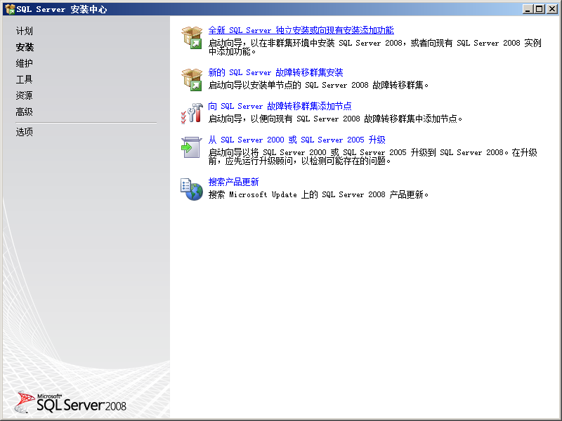

### 1.2.2安装程序支持规则

在1.2中选择了“全新sqlserver独立安装或向现有安装添加功能”后，安装将进入以下画面,此界面是检测系统安装环境是否符合要求。检测通过后，请点击“确定”。

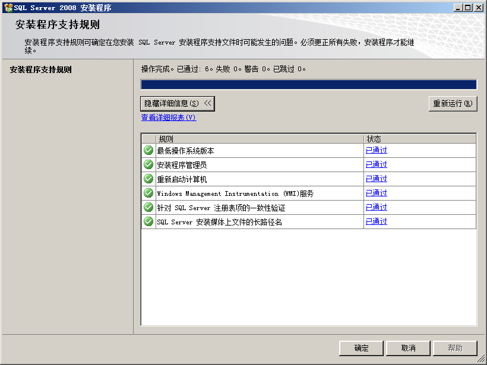

### 1.2.3安装程序支持文件

此处是检测数据库系统安装所必备的组件，点击“安装”即可。

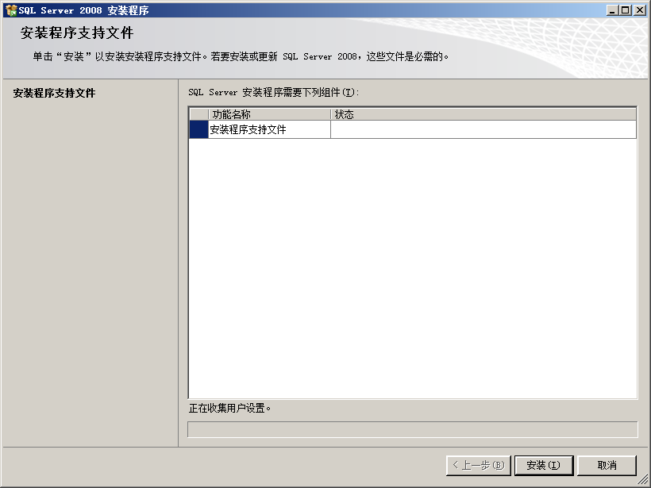

### 1.2.4安装程序支持规格

此处是检测系统中现有的软件，通过后点击“下一步”。防火墙不通过，并不影响系统的安装。

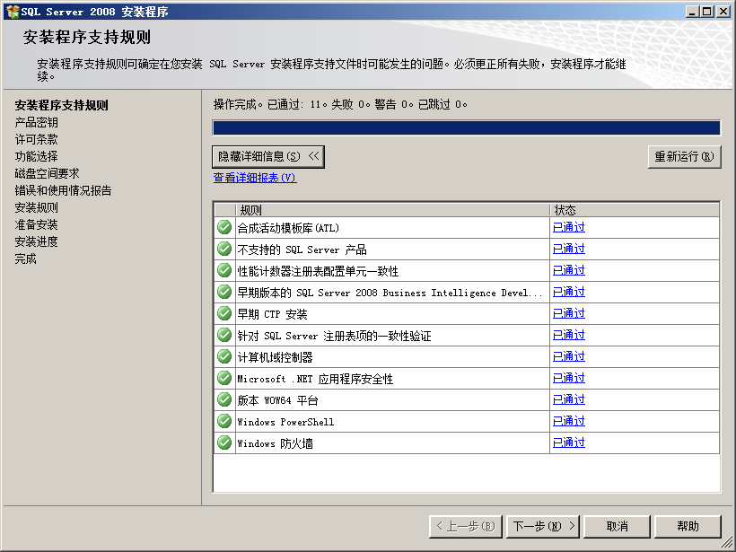

### 1.2.5输入产品密钥

产品密钥：JD8Y6-HQG69-P9H84-XDTPG-34MBB，如果此密钥失效，请去百度搜索"sqlserver2008企业版
密钥"。输入完密钥后点击“下一步”。

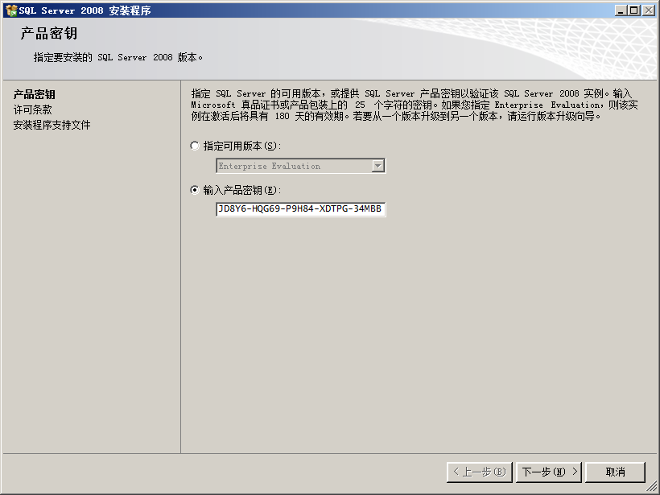

### 1.2.6许可条款

请选择“我接收许可条款”，并点击“下一步”。

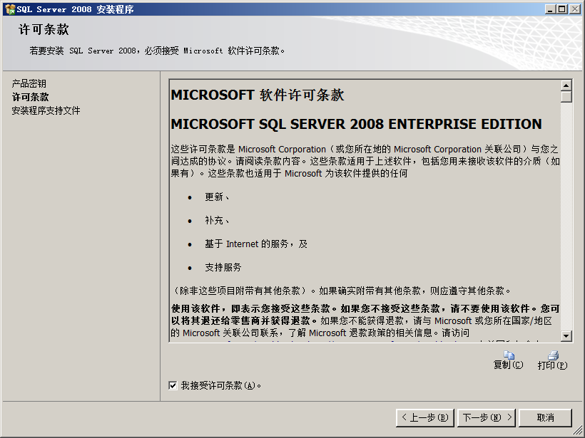

### 1.2.7数据库系统功能选择

请按下图选择数据库系统所需要的功能，全部选择并不会影响系统使用。选择完后点击“下一步”。

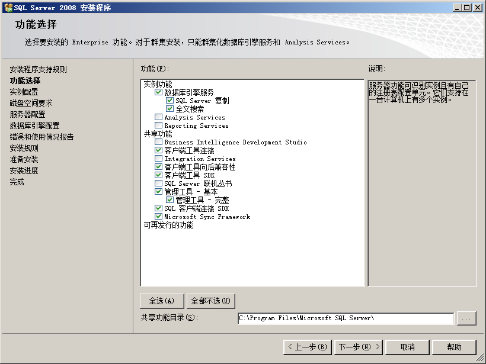

### 1.2.8实例配置

请选择默认实例(采用默认名称即可)，点击“下一步”

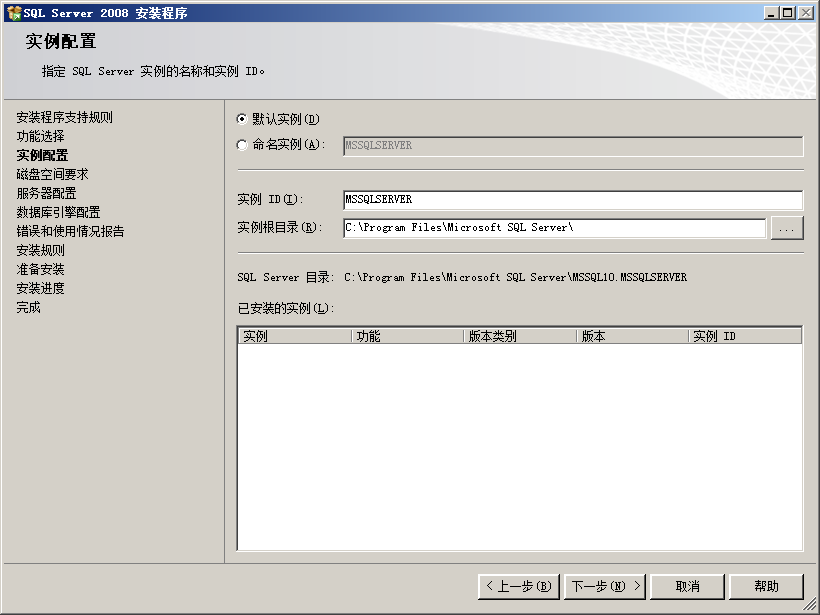

### 1.2.9磁盘空间要求

检查磁盘空间，如果磁盘空间不够，请返回“上一步”修改安装路径，然后点击“下一步”。

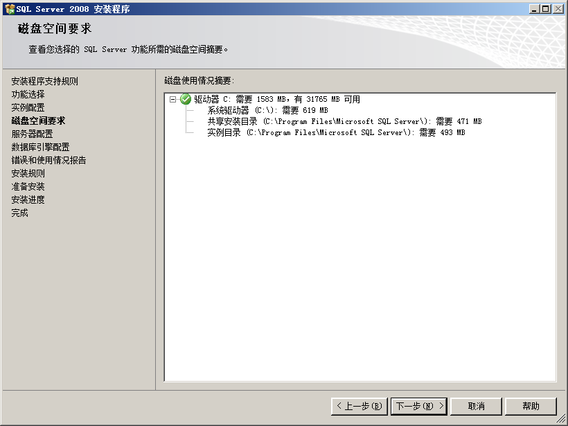

### 1.2.10服务器配置

在“服务账户”选项卡中，账户名请选择“**NT AUTHORITY\\NETWORK SERVICE**”

点击“下一步”。

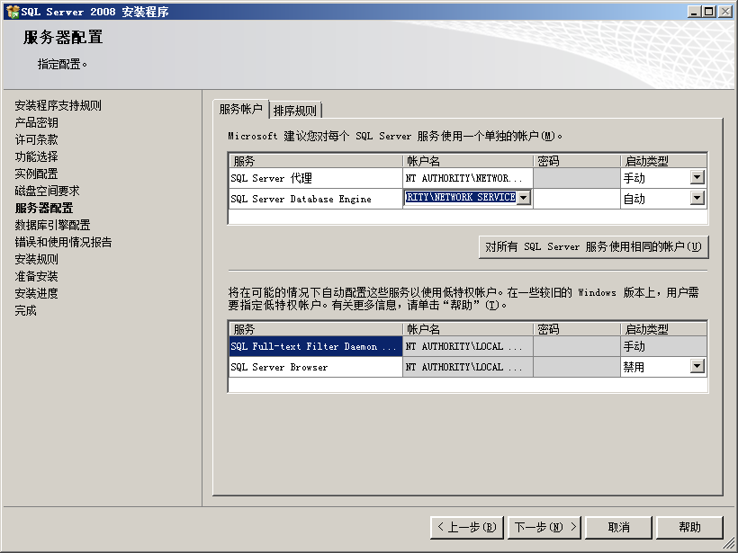

### 1.2.11数据库引擎配置

账户设置选项卡：在身份验证模式处，选择"**混合模式**"，然后输入密码（密码必须是数字，字母和特殊符号的组合），再点击“**添加当前用户**”按钮。

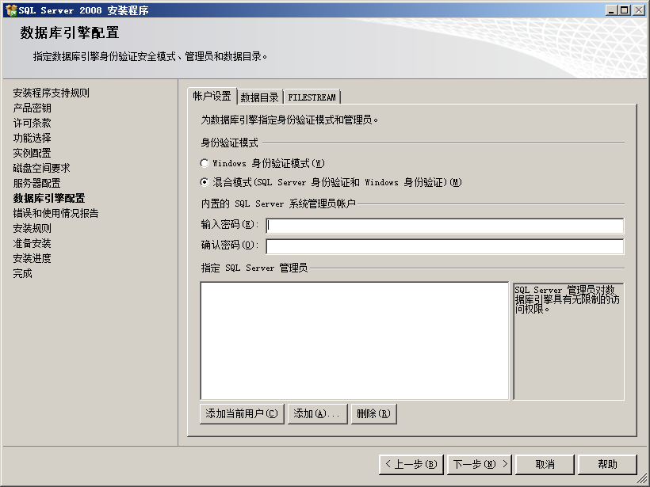

数据目录选项卡：请把各目录修改为非系统盘。（放置系统崩溃后数据丢失）设置完成后点击“下一步”。

### 1.2.12错误和使用情况报告

请把两个复选框设置为取消选中状态，并点击“下一步”

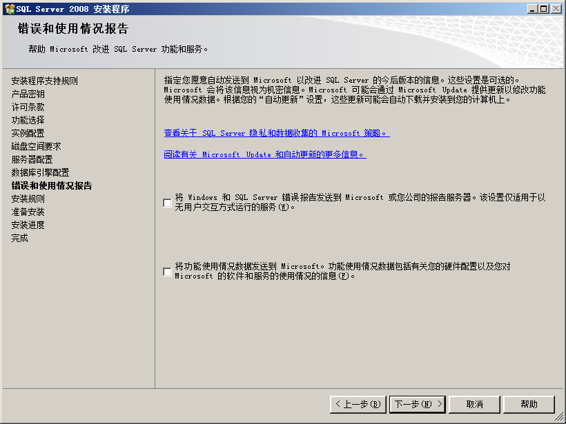

### 1.2.13安装规则

安装程序会对前面设置的步骤进行效验，如果效验失败则不能进行下一步，请返回前述步骤进行修改。只要“下一步”按钮呈可用状态，则可进行下一步安装。验证通过后点击“下一步”。

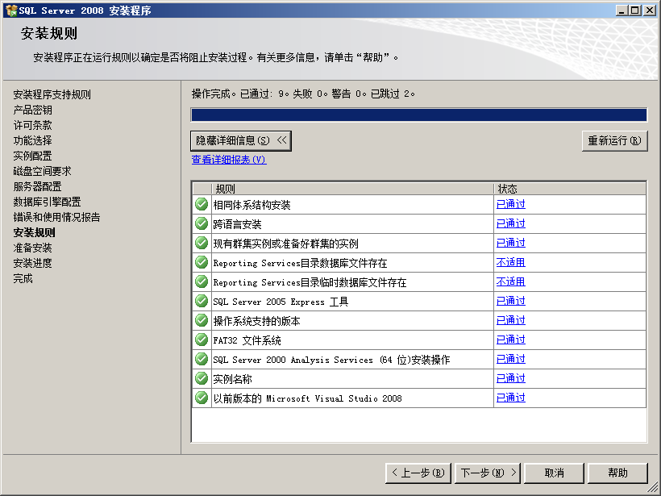

### 1.2.14准备安装

前述步骤的所有设置，都会在此界面全部呈现。安装人员可在此处进行一一核对。确认无误后，点击“下一步”。直至最后安装完毕即可。

#2、管理程序安装

##2.1、管理程序安装

双击运行“ClientNewSetup\_x86\_”，进行管理程序的安装，弹出以下安装界面

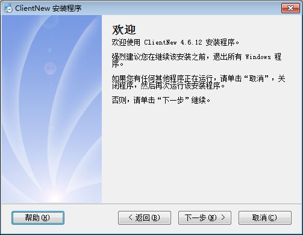

单击下一步，

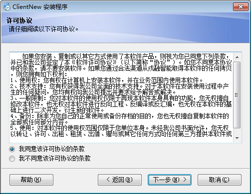

单击下一步

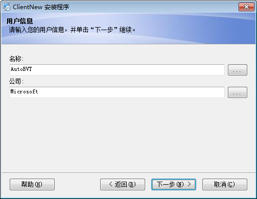

单击下一步

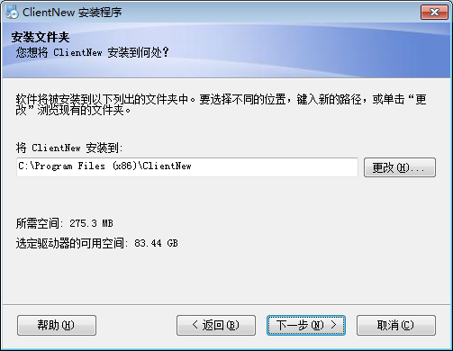

如需更改点击更改，选择相应的管理程序安装路径

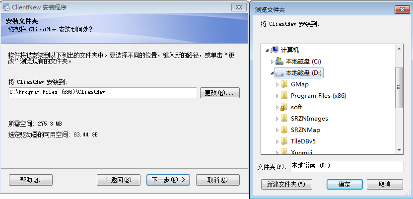

如果不需要修改，则一直点击下一步直到管理程序安装完成。

管理程序安装完成以后，自动进行数据库初始化/升级操作

#3数据库初始化

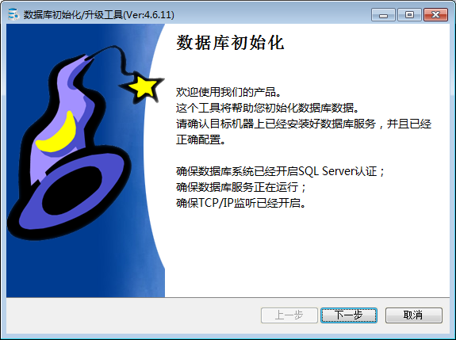

##3.1创建数据库

数据库管理系统：MS SQL Server （默认值即可）

数据库服务器：(local) （默认值即可）

身份验证： windows 身份验证 （默认值即可）

数据库名称：BrainNew （默认值即可）

用户名： （默认值即可）

密码： （默认值即可）

数据库文件存放路径：**请选择非系统盘**

设置完毕后点击“下一步”。

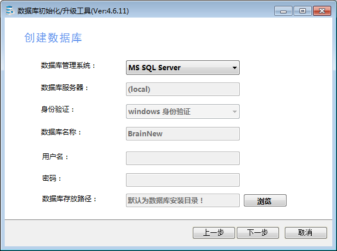

##3.2 数据库安装进度

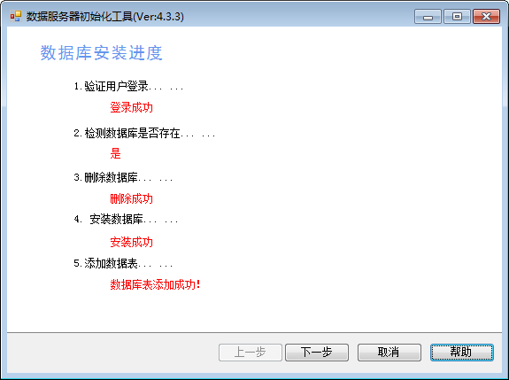

如果之前安装过运行过管理软件，即在数据库存在数据的情况下，则会弹出以下窗口

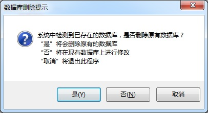

注意：如果选“是”，即删除已经存在于数据库中所有的报警事件的数据且不可恢复(谨慎使用)，建议选“否”，即在原有的数据库上进行升级修改，点“取消”，即退出此程序的安装。

##3.3配置超级管理员

此处的超级管理员是指
主动智能视觉预警分析系统的超级管理员，一经设定则不能更改，请牢记用户名和密码。

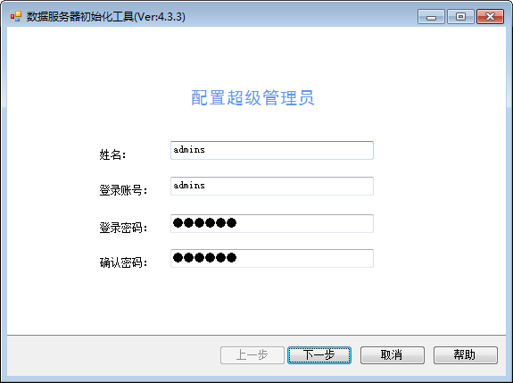

##3.4信息确认

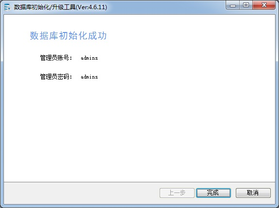

点完成即可完成整个数据库初始化的安装。

#4、管理程序的使用

点击桌面
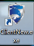此图标，即可打开客户端界面，如下图所示，此处登录的用户名和密码，是使用数据库初始化工具时设定的超级管理员用户名和密码。

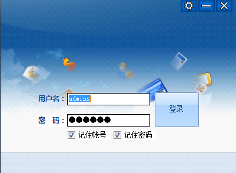

管理程序的使用，请参考《管理程序使用说明书》
