#前 言

编写本使用说明书的目的是为了充分叙述智能预警系统管理程序所能实现的功能及其运行环境，以便使用者了解该软件的使用范围和使用方法，并为软件的维护和更新提供必要的信息。

一、概述
--------

### 1.软件用途

本软件是针对智能预警系统而编写的应用软件，为金融行业安全保卫部门工作人员提供一个有效的管理分析工具，通过连接计算机和智能预警系统前端设备，使用本软件实现对无人值守自助营业厅有效监控范围内的异常行为等情况进行检测报警处理，并具备远程设备维护、报警事件查询、电子地图显示、电子表格、图形报表生成输出等数据管理功能。

### 2.软件环境

本软件运行在PC及其兼容机上，使用WINDOWS操作系统，在软件安装后，直接点击相应图标，即可显示登陆界面，进行需要的软件操作。

### 3.系统配置

本软件要求在PC及其兼容机上运行，配置要求如下：

1.  处理器：CPU不低于Intel I3-3220

2.  内存：不低于4G(视需要管理的智能预警系统前端服务器数量而定)

3.  硬盘：不低于500G(视具体的数据保存时间和设备数量而定)

4. 操作系统：WINDOWS7(包含)以上，需安装NetFramework4.5、VC2013、VC2012运行环境

### 4. 系统组成

ATM自助区域的智能分析主机。

监控室的智能预警管理软件。

ATM人脸图像分析服务器（选配）

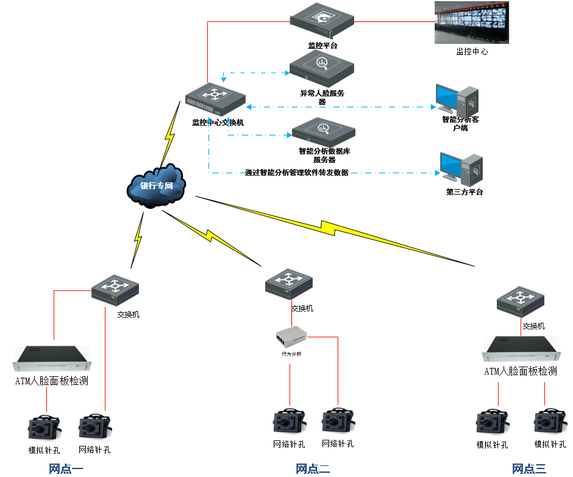{width="5.779166666666667in"
height="4.802083333333333in"}

二、技术支持
------------

### 1.技术服务

为了有效地保障最终用户的利益，本公司提供以下技术支持方式：

1.  提供7×24专业电话技术支持。

2.  远程服务：如果用户在本公司技术人员指导下通过自行操作仍不能解决问题，在用户授权的条件下，可为用户提供远程服务。

3.  现场服务：当远程服务仍无法解决问题时，本公司可派遣技术人员提供上门服务，现场解决问题。

4.  升级服务：本公司产品升级后，可以局域网在线升级方式或邮寄光盘方式实现。软件升级遇到困难时，本公司将提供上门服务。

#第一章 使用入门

一、系统登录及退出
------------------

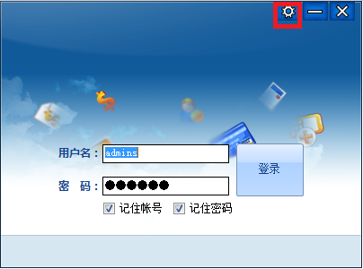{width="4.209027777777778in"
height="3.1277777777777778in"}

**1.登录：**输入用户名和密码，点击登录，即进入系统。勾选记住账号、和记住密码，再次登录无需输入账户名和密码。

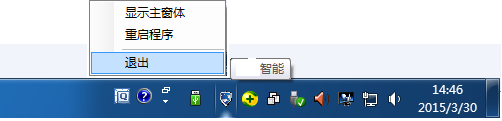{width="5.232638888888889in"
height="1.2555555555555555in"}

**2.退出：**在任务栏"智能预警管理程序"图标上右击，在快捷菜单上点击"退出"。

二、基础服务参数设置
--------------------

在系统登录界面，点击上图所示的红色方框标示的图标，进入基础服务参数设置模块。

2.  基础服务参数设置模块分为六个部分：基础设置、事件接收服务、地图设置、语音通话设置、视频联动设置、其他设置。基础服务信息设置是保证系统正常运行所必须的参数设定，要启用某一个或多个功能则需要设置对应的参数。每个部分的参数设置完后，请点击保存设置。

### 1.基础设置

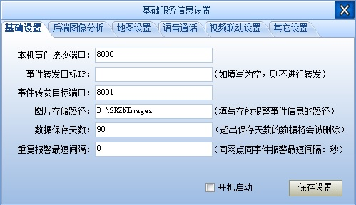{width="5.197916666666667in"
height="3.0in"}

1.  本机事件接收端口：此端口为事件接收端口；默认为8000，可根据具体接收事件的服务器填写相应的端口。。

2.  事件转发目标IP：如果此处部署其他接受事件的服务器，如果没有则保持为空。

3.  事件转发目标端口：此端口为事件转发端口；默认为8001，可根据具体接收事件的服务器填写相应的端口。

4.  图片存储路径：填写报警图片存放的地址。管理程序接受报警信息后，将报警图片存放的位置。

5.  数据保存天数：超出保存天数的数据将自动删除。

6.  重复报警最短间隔：同一网点同一事件报警最短的时间间隔：秒

7.  开机启动：勾选后，开机时管理程序自动启动

2、事件接收服务
===============

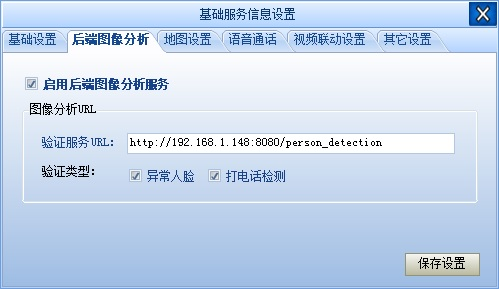{width="5.197916666666667in"
height="3.0118055555555556in"}

事件二次验证：如果使用了后端图像分析服务器对人脸进行精确分析，需要在此处添加验证服务器的URL以及需要验证类型：异常人脸（戴墨镜、戴口罩、戴头盔）、打电话检测。

3、地图设置
===========

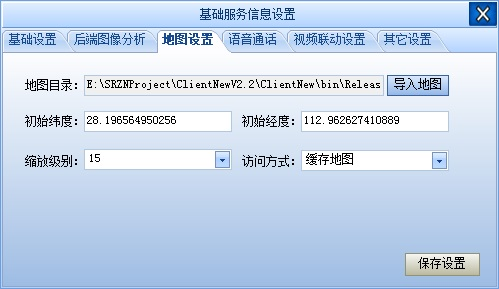{width="5.197916666666667in"
height="3.0118055555555556in"}

①地图目录：默认地图为长沙市地图，如需切换到当前城市的地图，选择“导入地图”，
选择已下载完毕的当前城市地图。\
*（关于如何下载离线地图，请参考《帮助文档-离线地图》）*

②初始经纬度：管理程序登录后默认显示的地图位置。

③ 缩放级别以及访问方式：使用默认设置即可。

### 4、语音通话设置

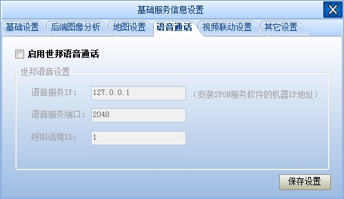{width="5.197916666666667in"
height="3.0118055555555556in"}

1.  语音服务器IP：安装SPON服务软件的机器IP。实现管理软件与世邦语音通话的兼容。

2.  语音服务端口：默认为2048。通过此端口实现通信。

3. 呼叫话筒ID：SPON话筒ID号。

### 5.视频联动设置

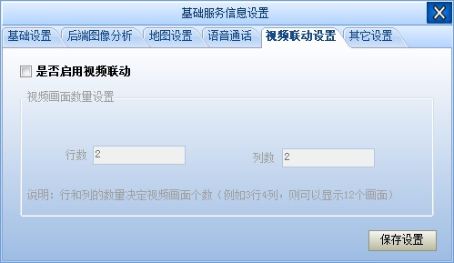{width="4.686111111111111in"
height="2.720833333333333in"}

1.  行数：控制视频画面显示n行。

2.  列数：控制视频画面显示n列。

### 6、其他设置

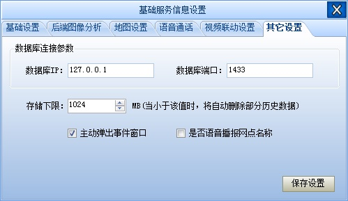{width="4.965277777777778in"
height="2.8722222222222222in"}

① 数据库连接参数：此处填写数据库服务器的IP地址以及相应端口

②可以自定义硬盘空间下限，当硬盘空间低于设定值后，自动删除最早的历史数据

③
勾选“主动弹出事件窗口”，则报警事件图片随该网点报警实时弹出，不勾选则报警事件图片不随该网点报警实时弹出

④勾选“是否语音播报网点名称”，即可在语音播报事件的同时播报网点名称。

⑤保存设置，然后重启管理程序程序。

#实时监控

一、预警事件处理
----------------

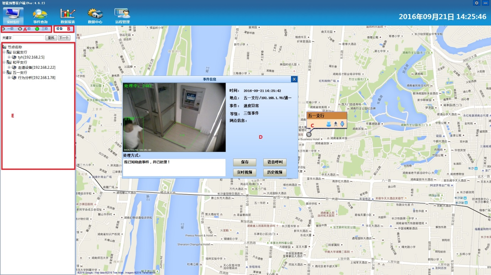{width="6.279166666666667in"
height="3.5347222222222223in"}

图中“A”区域为报警事件按等级分类，如一级事件出现在一级事件列表中。如需查看“一级、二级、三级”任意一栏的报警事件，只需单击对应的标签即可。在各级别前有个小圆点，当圆点为非灰色时代表此栏有报警事件未处理，提醒操作人员处理，处理完的事件将会从此栏消失。(如需查看已处理报警事件，操作步骤见"事件查询")

“B”区域显示当前用户所拥有管理权限的设备列表。

“C”区域是网点在地图上的显示位置,“000”代表事件发生时的网点内的人数，点击{width="0.25555555555555554in"
height="0.25555555555555554in"}图标，显示该网点最后一次的事件信息。点击{width="0.24444444444444444in"
height="0.24444444444444444in"}图标显示该网点实时监控画面，点击{width="0.29097222222222224in"
height="0.29097222222222224in"}图标为自动打开语音通话功能。

“C”小圆点，当事件发生时依级别不同会有红\\蓝\\绿灯闪烁。

“D”区域为报警事件信息显示区，显示当前事件发生的时间、地点、事件类型、网点信息、等级。D区域为报警事件处理区。点击““保存”后，自动弹出未处理的其他事件。点击“实时视频”显示的是行为分析仪的实时视频。而“历史视频”显示的是该报警事件的历史视频画面。如果与报警网点设置好了语音呼叫联动，点击“语音呼叫”即可实现语音通话功能，点击“挂断”即为断开语音通话。

二、音频联动设置
----------------

如果需要对某个智能预警系统前端服务器下的某个通道进行音频联动设置，可以在“B”区域中选择此设备下的具体的通道进行设置(见下图)。

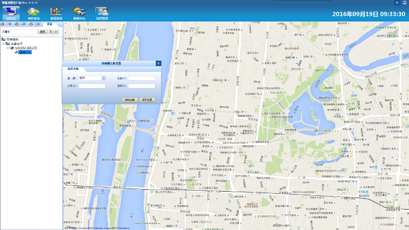{width="6.279166666666667in"
height="3.5347222222222223in"}

**语音关联：**选中通道或设备后，右击选择“联动设置”，在选项卡中点击“语音关联”选项卡，在语音关联窗口中，根据实际情况填写好各项参数信息（示例如下），保存设置即可。

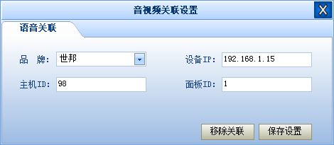{width="4.895138888888889in"
height="2.1395833333333334in"}

设置好语音关联后，选择设置的网点右击，就可以进行语音对讲了。

[[[[]{#_Toc16513 .anchor}]{#_Toc2447 .anchor}]{#_Toc415239213
.anchor}]{#_Toc415818850 .anchor}第三章 事件查询

点击“事件查询”进入事件查询界面，界面如下图所示。

界面分为两部分：左边为查询条件；右边为查询结果显示区。

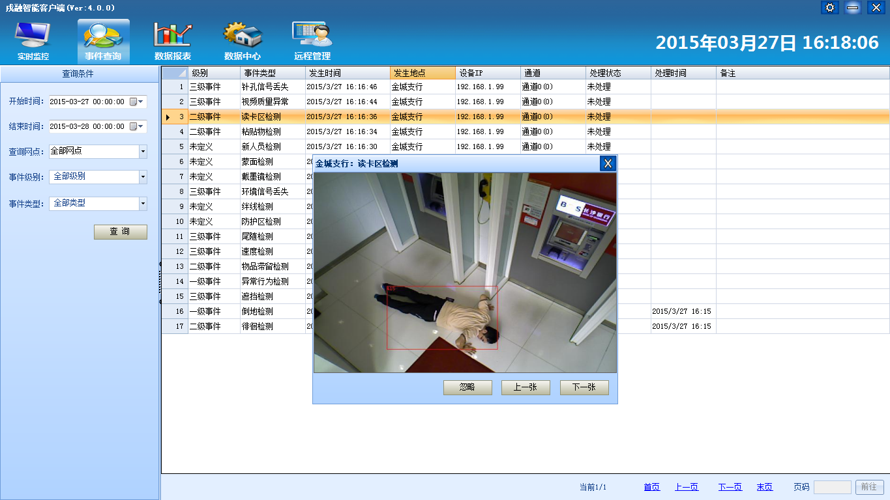{width="5.767361111111111in"
height="3.2444444444444445in"}

查询历史事件的方法有三种：按网点查询、按事件级别查询、按事件类型查询。

注意：在数据量较大的情况下，建议每次查询一周的数据，可加快检索速度。

三种查询方法的具体操作步骤如下，查询结束后，在查询结果显示区选中需查看的具体事件，双击即弹出报警事件图片。

**1.按网点查询：**

设置“开始时间”→设置“结束时间”→在“查询网点”中选择网点→“事件级别”、“事件类型”分别选择全部级别、全部类型→查询。

**2.按事件级别查询：**

设置“开始时间”→设置“结束时间”→“查询网点”选择全部网点→设置“事件级别”→“事件类型”选择全部类型→查询。

**3.按事件类型查询：**

设置“开始时间”→设置“结束时间”→“查询网点”选择全部网点→“事件级别”选择全部级别→设置“事件类型”→查询。

**4.查看历史事件：**

经过前三种方式查询出数据后，可以在预警记录上双击查看报警截图，或者“右击”选择“查看视频”的方式浏览抓拍视频。

#第四章 数据报表

点击“数据报表”，进入数据报表界面，界面如下图所示。

界面分三部分：左边为查询条件；右上部分为图形报表显示区；右下部分为事件统计分析区。

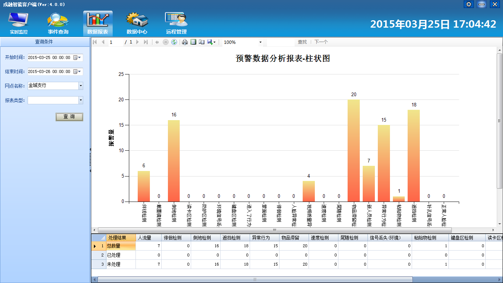{width="5.639583333333333in"
height="3.186111111111111in"}

在“数据报表”界面，涉及的操作有：生成数据报表和导出报表。其具体步骤如下：

**1.生成数据报表：**

设置“开始时间”→设置“结束时间”→“网点名称”中选择网点→设置“报表类型”→查询。

**2.导出报表：**

生成数据报表→在报表显示区单击右键→“Export”→选择“Excel、PDF、Word”→输入文件名→保存。

上图显示的是某一段时间内，按柱状图类型查询的结果。在图形报表显示区，各个事件统计结果以柱状直观显示。在右下部分的事件统计分析区，分析结果以具体的数字形式显现。

#数据中心

本章主要介绍网点的添加，设备的添加以及事件设置的调整

一、网点管理
------------

设备管理界面如下图：

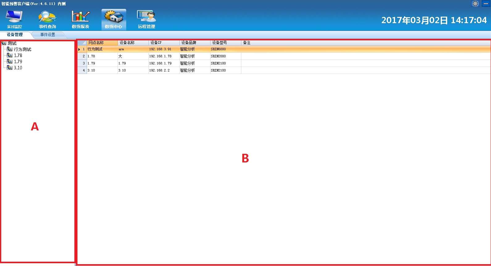{width="6.302083333333333in"
height="3.41875in"}

**1.新建网点：（网点就是银行某一个自助网点）**在设备管理界面A区域右击，选择“新建节点”，输入节点名称。

**2.重命名：**在设备管理界面A区域选中要重命名的节点名称，右击选择"重命名"后输入新的节点名称即可。

**3.删除节点：**在设备管理界面A区域选中要删除的节点，右击选择删除节点后，系统会自动弹出系统提示，点击即可。注意：删除节点时，节点的下级节点以及设备都将被删除，请谨慎操作。

**4.调整节点层次结构：**选中节点，按住鼠标左键拖动即可完成。

**5.设置节点参数：**在设备管理界面A区域选中要设置的节点，右击在弹出的快捷菜单中选择“设置节点参数”，系统会自动弹出节点信息编辑窗口。

网点信息编辑界面如下图：

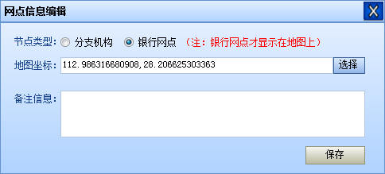{width="5.0465277777777775in"
height="2.279166666666667in"}

在窗口中**“节点类型”**处选择当前编辑节点所属类型，分支机构不会出现在地图上，主要用于划分网点的层次结构，只有设置成银行网点，在地图上选择该网点坐标位置后方可在地图界面上显示。

**备注信息：**通常可录入银行网点的地址、联系人、联系电话等信息，当有报警事件发生时，会自动出现在网点信息中。便于监控人员联系网点负责人处理警情。

二、设备管理
------------

设备指智能预警系统前端服务器，通常安装在自助银行加钞间，用于对视频进行智能预警分析。

**1.新增设备：**在设备管理界面A区域选中拟新增设备所属的银行网点，然后在设备管理界面B区域中右键单击，选择“新增设备”，弹出设备编辑界面（如下图所示）。在设备编辑界面A区域中编辑设备名称、IP、品牌、型号、备注信息等内容，在设备编辑区域B区域中选中需要修改的通道名（如“通道0”），单击，输入新的通道名，如“行为分析”，然后点击保存按钮保存设备参数。

**2.编辑设备：**在设备管理界面B区域中选中一个设备后右键单击，选择“编辑设备”，系统弹出“编辑设备”窗口，可以对设备参数重新编辑。

**3.删除设备：**选中要删除的设备，右击选择“删除设备”即可完成设备删除，设备删除后对应的事件信息也将被删除。

对设备和网点进行修改后，可右击选择“刷新数据”实现手动刷新设备列表。

设备编辑界面如下图：

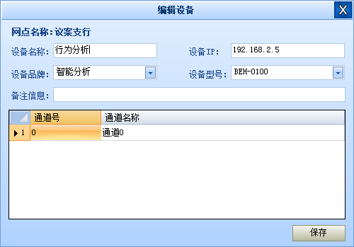{width="5.209027777777778in"
height="3.6395833333333334in"}

三、事件级别
------------

在事件设置界面A区域中选中“事件等级”，B区域将显示该等级下的事件类型。“未定义”级别的中事件类型，是不会主动弹出报警画面的，只会存档在历史报警画面中，可以通过事件查询界面查询。

在B区域中选中需要编辑的事件类型，在事件等级下拉菜单中选择相应等级，然后再点击空白处即可完成级别调整。最后一项为语音播报的次数，填写相应的数字代表播报的次数。

事件设置界面如下图：

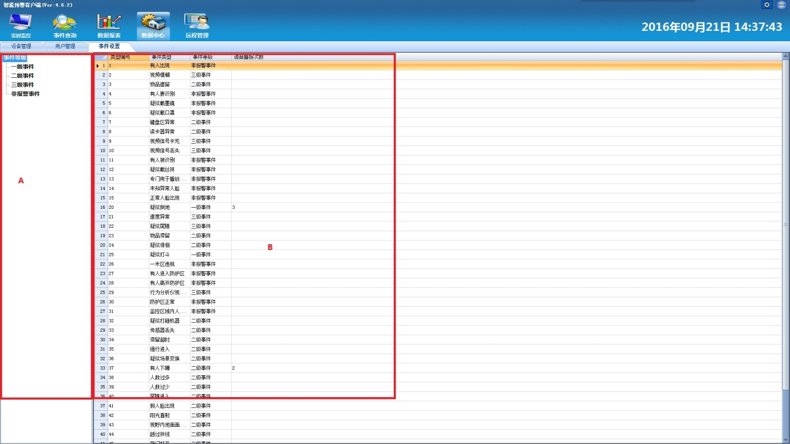{width="6.279166666666667in"
height="3.5347222222222223in"}

**第六章 远程管理**

本章主要介绍网点设备参数的调整，前段固件版本升级的使用方法。

ATM机针孔摄像头对应传统模拟摄像头和先进网络高清摄像头

一、设备工作状态查看
--------------------

本系统可查看介入系统内的智能预警系统前端服务器是否在线，同时按下Ctrl、Alt、Shift和空格键，则会弹出如下图所示窗口，窗口会显示接入系统内的网点名称、设备名称、设备IP、工作状态及连接与断开时间。

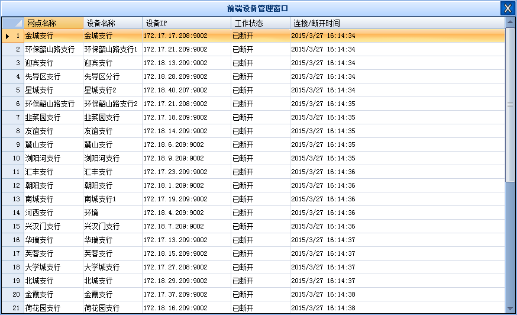{width="5.674305555555556in"
height="3.453472222222222in"}

设备参数设置
------------

进入管理程序主界面后点击“远程管理”图标，显示远程管理界面，在左侧的设备列表里面选择需要设置的设备，弹出该设备的设置界面，并选择需要设置的通道：

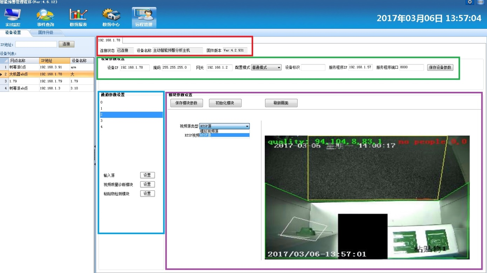{width="6.302083333333333in"
height="3.5347222222222223in"}

### 1.界面概述：

1.  上图中，红色方框内为**设备信息**，包括连接状态，设备名称和固件版本号，已上设备信息自动获取不能修改，

2.  绿色方框内为**设备配参数置**

> （1）包括设备IP地址，子网掩码，网关，其中相应的网络设置可通过在此处进行修改，修改完毕以后点击保存设备设置。
>
> （2）配置模式分为“普通模式”和“高级模式”，建议客户只使用普通模式进行设置，高级模式只适合专业人士来进行深层次的参数调整，严禁普通客户进行操作。
>
> （3）服务程序IP：设备报警的目标设备(即本管理程序所处的机器IP地址)
>
> 服务程序端口：设备报警的目标设备的端口，对应在基础设置“本机
>
> 事件接收端口”。

1.  蓝色方框内上方的数字表示该设备所有的通道号。

2.  蓝色方框内下方表示对应通道的各模块参数设置。

3.  紫色方框内参数绘制区操作介绍：

> 点击蓝色框中的设置按钮后，将在右侧的紫色框中出现该模块对应的参数设置，针对不同的设备，参数均不相同，具体设置可参考各类型设备的使用说明。

**a.绘制：**点击“绘制”按钮后，方可在所选通道画面内进行检测区域绘制。

> **b.保存模块参数：**单击此按钮，绘制后的检测区域方可生效。
>
> **c.刷新：**单击此按钮对设置界面进行刷新，让设置界面保持最新状态。
>
> **d.画面比例：**可以根据需要调整通道画面显示比例的大小。
>
> **e.初始化通道：**单击此按键，对当前通道的环境进行初始化。

#第七章
地图下载工具使用说明**

1、文件夹结构说明：下图紫色区域所示文件夹为高德地图的缓存目录，蓝色区域所示文件夹为谷歌地图的缓存目录。通过地图下载工具下载的地图会分别缓存在该文件夹下。

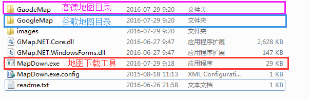{width="5.767361111111111in"
height="1.8722222222222222in"}

2、启动地图下载工具：要启动地图下载工具，请双击MapDown.exe(新版)或者GMapDemo.exe(老版),启动后界面如下：

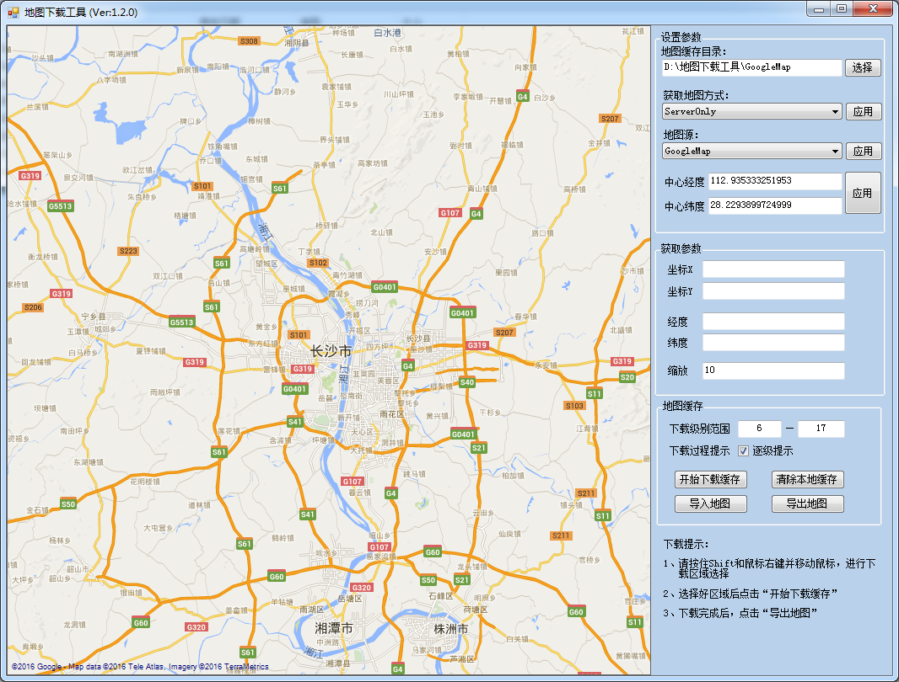{width="5.767361111111111in"
height="4.384027777777778in"}

参数说明：

**地图缓存目录：**下载地图时存储的位置，地图下载完成后需要将该文件夹复制到管理程序程序所在电脑。

**获取地图方式：**

ServerOnly： 仅从服务器下载地图

ServerAndCache：从服务器和缓存下载地图，缓存中有数据则从缓存下载，

缓存中无数据则从服务器下载

CacheOnly： 仅从缓存下载

**地图源：目前采用的是谷歌地图**

GoogleMap：下载谷歌地图

GaodeMap：下载高德地图

**中心经纬度:**

打开地图时，默认显示的中心点的位置

**获取参数：**

坐标X，坐标Y：指鼠标在地图上双击时获取到的坐标(该值可忽略)

经度、纬度：鼠标在地图上双击时，能获取到地图上某一点的经纬度。该经纬度用于设置管理程序中的初始纬度和初始经度(初始纬度和初始经度是指管理程序在显示地图界面时默认的中心点位置)

{width="5.197916666666667in"
height="3.0118055555555556in"}

智能预警管理程序地图设置界面

**缩放级别：**地图当前显示的缩放级别

**下载级别范围：**您将要下载的地图级别范围，级别范围越大，地图越清晰，同时

离线地图库也会越大。

**下载过程提示：**如果勾选主机提示，那么在每下载完一个缩放级别的地图后，会

提醒您是否下载下一级地图，如果未勾选则一次性下载完全部级别。

3、地图下载操作：

a\) 按住shift键和鼠标右键拖动，选择下载区域。

b\) 设定下载级别范围。

c\) 点击开始下载缓存，开始进入下载过程。

4、管理程序地图设置

a\) 将下载完成后的地图缓存文件(\*.gmdb)复制到管理程序所在电脑

b\) 在管理程序地图设置界面中，点击“导入地图”选中a步骤中的\*.gmdb文件。

c\) 设置地图的初始经纬度，此处经纬度可在地图下载工具中双击任意一点获取。

d\) 访问方式：请设置为缓存地图

{width="5.197916666666667in"
height="3.0118055555555556in"}

5.  管理程序地图设置完成后，重启管理程序程序即可。

常见故障：

一、地图无法显示:

1、请检查是否下载了缓存地图，例如该管理程序中的地图是广州地图，但现在用在河南地区，则需要下载河南的地图。

2、地图目录是否设置正确

3、初始经纬度是否设置正确，例如离线地图库是广州的，但是初始的经纬度却定位成了上海。

#第八章 附录

一、附录A疑难解答
-----------------

**1．管理程序软件收不到某一设备的报警信息？**

**解决办法：**

A．请检查当前用户是否有权限管理此设备。

B．请检查该设备的网络连接，确认网络连接无误后，重启该设备即可。

**2．管理程序收不到全部网点的报警信息？**

**解决办法：**

A．重启管理程序程序。

B．重启管理程序后依旧不能解决问题，请检查网络连接是否正常。

**3．管理程序接收不到某一类型的报警事件？**

**解决办法：**

A．检查事件级别是否设置成了“未定义”,"未定义"级别中的事件只会存档，不会主动弹出报警画面
。

**4．接收不到某一设备的某些报警事件类型？**

**解决办法：**

A．检查各类型报警事件的参数设置级别是否设置过高。

B．防护区是否关联正常。

**5．为什么在设备列表里面看不见任何设备或某些设备？**

**解决办法：**

A．请检查当前用户是否拥有相应的权限。用户权限设置请参阅"数据中心"-&gt;"用户管理"-&gt;"编辑用户"。

**6、为什么在地图模式下没有显示网点？**

**解决办法：**

A．请检查该网点的"节点类型"是否设置为"银行网点"。
请在"数据中心"-&gt;"设备列表"-&gt;"设置节点参数"
将"节点类型"修改为银行网点。
